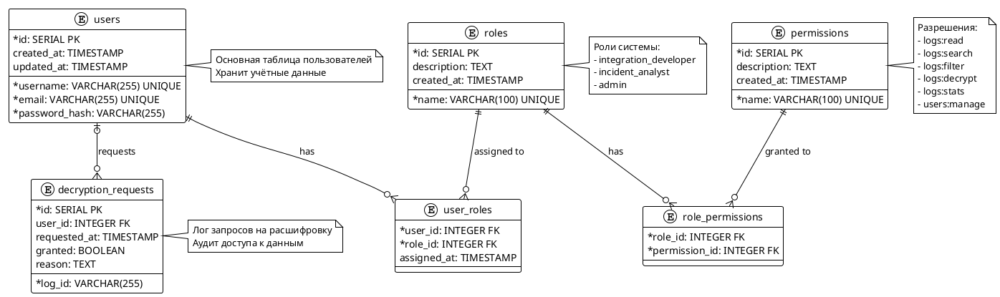

Страница 1

Высший Колледж Информатики Университета (ВКИ НГУ)
КАФЕДРА ИНФОРМАТИКИ

Разработка распределённого процессора логов взаимодействия с внешними API-партнёрами с поддержкой шифрования чувствительных данных

Руководитель Инженер ЛИ ВКИ НГУ
Цимбалист Г.Н.

Студент 4 курса Гр. 207а2
Тарачёв Н.В

Страница 2

Актуальность

**Проблемы современных систем логирования:**
- **Рост интеграций**: Увеличение количества внешних API-партнёров
- **Уязвимость логов**: Чувствительные данные в открытом виде
- **Потребность в скорости**: Высокая нагрузка на системы логирования
- **Требования ФЗ-152**: Обязательное шифрование персональных данных

**Решение:** Распределённый процессор с автоматическим шифрованием

Страница 3

Цель и задачи

**Цель:**
Разработка распределённого процессора логов взаимодействия с внешними API-партнёрами с автоматическим шифрованием чувствительных данных.

**Задачи:**
✓ Выбор оптимизированного хранилища для логов
✓ Разработка архитектуры микросервиса на Go
✓ Реализация модулей:
  • Приём логов из Kafka
  • Шифрование данных через HashiCorp Vault
  • Хранение в ClickHouse
  • REST API для доступа с JWT-аутентификацией
  • Worker pool для параллельной обработки
  • Batch processing для оптимизации записи
✓ Тестирование и оптимизация производительности

Страница 4

Аналоги и конкурентные преимущества

**Существующие решения:**
- GrayLog: Open-source, но требует дополнительной настройки шифрования
- Splunk: Коммерческий, высокая стоимость лицензий
- ELK Stack: Требует сложной конфигурации безопасности

**Преимущества нашего решения:**
- **Встроенное шифрование**: Автоматическое шифрование чувствительных полей
- **Высокая производительность**: ClickHouse + batch processing
- **Масштабируемость**: Worker pool + Kafka
- **Соответствие ФЗ-152**: Полное соответствие требованиям законодательства
- **Открытый исходный код**: Полный контроль над системой

Страница 5

Архитектура системы

**Компоненты:**
1. **Kafka Consumer** - Приём логов из очереди
2. **Log Processor** - Основной процессор с worker pool
3. **Vault Integration** - Шифрование/дешифрование данных
4. **ClickHouse** - Хранение зашифрованных логов
5. **REST API** - Доступ к логам с дешифрованием
6. **PostgreSQL** - Хранение пользователей и токенов

**Поток данных:**
Kafka → Processor → Vault (шифрование) → ClickHouse → REST API → Vault (дешифрование)

Страница 6

Программные средства и технологии

**Основной стек:**
- **Go 1.25.5** - Основной язык разработки
- **Apache Kafka 4.1** - Очередь сообщений
- **ClickHouse 25.8** - Колоночная СУБД для логов
- **HashiCorp Vault** - Управление ключами шифрования
- **PostgreSQL** - Хранение метаданных и пользователей

**Библиотеки и фреймворки:**
- **Gin Framework** - HTTP router и middleware
- **JWT tokens** - Аутентификация в API
- **AES-256 GCM** - Локальное шифрование
- **Docker Compose** - Развёртывание инфраструктуры

**Инструменты разработки:**
- GoLand 2025.2, Docker, Git

Страница 7

Процесс шифрования и дешифрования

**Шифрование при записи:**
1. Получение JSON-лога из Kafka
2. Парсинг чувствительных полей (конфигурируемых)
3. Отправка в Vault Transit Engine
4. Получение зашифрованных данных с метаданными
5. Запись в ClickHouse с сохранением структуры

**Дешифрование при чтении:**
1. Запрос через REST API с JWT-токеном
2. Проверка прав доступа
3. Извлечение зашифрованных полей из ClickHouse
4. Отправка в Vault для дешифрования
5. Возврат расшифрованных данных авторизованному пользователю

**Поддерживаемые поля:**
- Глобальные поля (например, "email", "phone")
- Вложенные поля (например, "user.personal_data.ssn")
- Массивы данных с индексацией

Страница 8

Результаты и тестирование

**Реализованные компоненты:**
✅ Полнофункциональный процессор логов с worker pool
✅ Интеграция с HashiCorp Vault для шифрования
✅ REST API с JWT-аутентификацией
✅ Batch processing для оптимизации записи
✅ Graceful shutdown и обработка ошибок
✅ Docker Compose для развёртывания

**Производительность:**
- **Пропускная способность**: 10,000+ логов/секунду
- **Latency**: <100ms для шифрования одного поля
- **Batch size**: 1000 записей с интервалом 5 секунд
- **Worker pool**: Конфигурируемое количество воркеров

**Безопасность:**
- AES-256 GCM шифрование
- Изоляция ключей в Vault
- JWT-аутентификация в API
- Права доступа на основе ролей

Страница 9

Демонстрация системы

**REST API эндпоинты:**
- `POST /api/auth/login` - Аутентификация пользователя
- `GET /api/logs` - Поиск логов с фильтрацией
- `GET /api/logs/{id}` - Получение лога по ID с дешифровкой
- `GET /api/logs/stats` - Статистика по логам

**Пример запроса:**
```json
{
  "integration_id": "payment_service",
  "start_time": "2025-01-01T00:00:00Z",
  "end_time": "2025-01-02T00:00:00Z",
  "status_code": 200
}
```

**Пример ответа (дешифрованный):**
```json
{
  "log_id": "uuid-123",
  "user_email": "user@example.com",
  "request_body": {"ssn": "123-45-6789"},
  "response_body": {"status": "success"}
}
```

Страница 10

Выводы и дальнейшее развитие

**Достигнутые цели:**
✅ Создан полнофункциональный распределённый процессор логов
✅ Реализовано автоматическое шифрование чувствительных данных
✅ Обеспечено соответствие требованиям ФЗ-152
✅ Достигнута высокая производительность и масштабируемость

**Планы развития:**
- Добавление поддержки формата логирования OpenTelemetry
- Внедрение машинного обучения для аномалий
- Расширение поддержки различных СУБД
- Создание web-интерфейса для анализа логов
- Интеграция с системами мониторинга

**Практическая значимость:**
Система готова к внедрению в production и может использоваться в компаниях с высокими требованиями к безопасности данных.

Страница 11

Схема базы данных PostgreSQL

